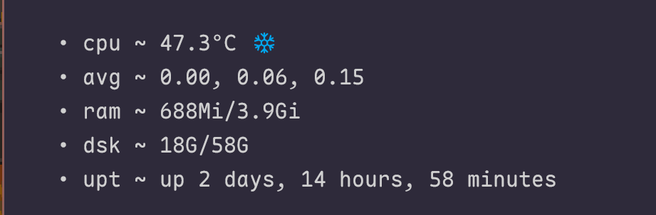
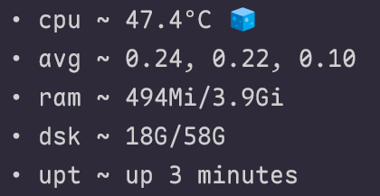
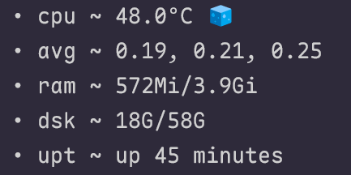
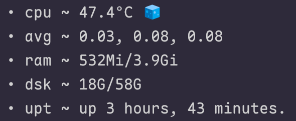
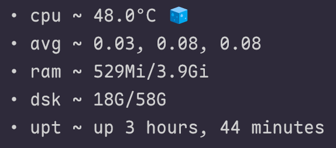
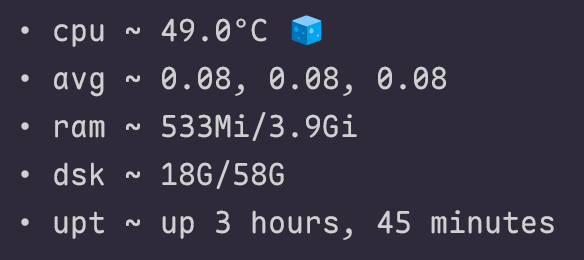

# pi 5

things i've set up so far on my headless pi, homelabbing has gotten to me

## the usual (specs)

- ubuntu 24.04.4 lts
- 4gb ram
- cpu doesn't differ in [any](https://pip-assets.raspberrypi.com/categories/892-raspberry-pi-5/documents/RP-008348-DS-6-raspberry-pi-5-product-brief.pdf) pi 5

## what's running?

- pihole
- grocery list (for mom!! :D)
- navidrome + slskd
- tailwind
- ntfy
- ssh

...and all that for mere ~500-700Mi

## cut to the chase

pi 5 usually idle at ~2w, which is extremely low, but how about furthermore decreasing it? to give you a glimpse:

<div align="center">
  
  
  
</div>

"**does it even matter?**" while some options such as `vc4hdmi` for audio output through hdmi make little to no difference, other options as wifi/bluetooth consume _at least_ a minor margin, this is about microperfections, not a groundbreaking difference ([quote](https://en.wikiquote.org/wiki/Linus_Torvalds) "People say that you should not micro-optimize; but, if what you love is micro-optimization, that's what you should do." / [yt](https://www.youtube.com/watch?v=MShbP3OpASA&t=1330s))

> for older models, have a look into [eeprom](https://www.raspberrypi.com/documentation/computers/raspberry-pi.html#raspberry-pi-bootloader-configuration), specifically `WAKE_ON_GPIO` dropping tdp from 1-2w down to 0.01w [source](https://www.jeffgeerling.com/blog/2023/reducing-raspberry-pi-5s-power-consumption-140x/), no issue in including it in the eeprom configuration anyway

| do you need this? | see if it's on | turn it off! |
|:---:|:---:|:---:|
| bluetooth | `rfkill list bluetooth` | [->](###bluetooth) |
| wifi | `rfkill list wifi` | [->](###wifi) |
| hdmi audio | `cat /proc/asound/cards` | [->](###audio) |
| power led | 👁️ (`dtparam -a \| grep 'act-led'`) | [->](###pwr-led) |
| eeprom | `rpi-eeprom-config` | [->](###eeprom) |
| swappiness | `cat /proc/sys/vm/swappiness` | [->](###swappiness) |
| services | - | [->](###services) |

## turning various things off

here's a full list of the `/boot/firmware/config.txt`, disabling specific things will be listed as sub header below

```sh
[all]
arm_64bit=1
kernel=vmlinuz
cmdline=cmdline.txt
initramfs initrd.img followkernel

# Enable the audio output, I2C and SPI interfaces on the GPIO header. As these
# parameters related to the base device-tree they must appear *before* any
# other dtoverlay= specification
dtparam=audio=off
dtparam=i2c_arm=off
dtparam=spi=off

# Comment out the following line if the edges of the desktop appear outside
# the edges of your display
disable_overscan=0

# If you have issues with audio, you may try uncommenting the following line
# which forces the HDMI output into HDMI mode instead of DVI (which doesn't
# support audio output)
#hdmi_drive=2

# Enable the KMS ("full" KMS) graphics overlay, leaving GPU memory as the
# default (the kernel is in control of graphics memory with full KMS)
dtoverlay=vc4-kms-v3d,noaudio
disable_fw_kms_setup=1

# Enable the serial pins
enable_uart=1

# Autoload overlays for any recognized cameras or displays that are attached
# to the CSI/DSI ports. Please note this is for libcamera support, *not* for
# the legacy camera stack
camera_auto_detect=0
display_auto_detect=0

# Config settings specific to arm64
dtoverlay=dwc2

# reduce overhead
# -- connectivity
dtoverlay=disable-wifi
dtoverlay=disable-bt
# -- pwr led
dtparam=pwr_led_trigger=none
dtparam=pwr_led_activelow=on
dtparam=act_led_trigger=none
dtparam=act_led_activelow=off
dtparam=eth_led0=4
dtparam=eth_led1=4
```

### bluetooth

```sh
dtoverlay=disable-bt
```

you may also disable the service

```sh
systemctl disable bluetooth.service
```

### wifi

```sh
dtoverlay=disable-wifi
```

### audio

```sh
dtoverlay=vc4-kms-v3d,noaudio
```

### pwr-led

note that you **cannot** disable the **red** led when it is shut down, as it's hardwired to the 5V psu to indicate that power is present, hence setting this through software/device tree params is NOT possible (opaque tape or nail polish will do, no need to unsolder it)

```sh
dtparam=pwr_led_trigger=none
dtparam=pwr_led_activelow=on
dtparam=act_led_trigger=none
dtparam=act_led_activelow=off
dtparam=eth_led0=4
dtparam=eth_led1=4
```

> if `pwr_led_trigger=none` is set, but the pi says "haha no i stay ON", invert the `pwr_lwd_activelow` param to `on`, (like i had to). activity led should be self explanatory

### eeprom [->](https://www.raspberrypi.com/documentation/computers/raspberry-pi.html#raspberry-pi-boot-eeprom)

inherently, eeprom is superior to flash in a pi, considering there is no permanent i/o ongoing, essentially saving the state of the program in non-volatile memory. a lot of opretations or logs would benefit from an external flash instead, read more [\[1\]](https://www.electronicsforu.com/technology-trends/learn-electronics/eeprom-difference-flash-memory) [\[2\]](https://www.reddit.com/r/embedded/comments/xum8bn/can_someone_explain_me_what_flash_and_eeprom_are/) before turnin things on and off mindlessly [docs](https://www.raspberrypi.com/documentation/computers/raspberry-pi.html#raspberry-pi-bootloader-configuration)
firstly update & reboot if everything goes well

```sh
sudo rpi-eeprom-update
# if theres a neweer version, do:
sudo rpi-eeprom-update -a
sudo systemctl reboot
```

then edit

```sh
sudo rpi-eeprom-config -e

[all]
BOOT_UART=1
WAKE_ON_GPIO=0
BOOT_ORDER=0xf1
NET_INSTALL_AT_POWER_ON=0
POWER_OFF_ON_HALT=1
```

**BOOT_UART** [->](https://www.raspberrypi.com/documentation/computers/raspberry-pi.html#BOOT_UART) & **WAKE_ON_GPIO** [->](https://www.raspberrypi.com/documentation/computers/raspberry-pi.html#BOOT_UART)
as stated from the [source](https://www.jeffgeerling.com/blog/2023/reducing-raspberry-pi-5s-power-consumption-140x/) "I'm including it for completeness" (unless you're NOT on pi 5)

**BOOT_ORDER** [->](https://www.raspberrypi.com/documentation/computers/raspberry-pi.html#BOOT_ORDER)
i encourage you to set `BOOT_ORDER` to the appropriate boot media

```sh
lsblk -o NAME,SIZE,TYPE,MOUNTPOINT`
# mmcblk = sd card, sdX = usb, etc
```

see the [BOOT_ORDER](https://www.raspberrypi.com/documentation/computers/raspberry-pi.html#BOOT_ORDER) fields. the pi automatically set it to `0xf461`, which would probe as: `SD CARD` -> `NVME` -> `USB-MSD` -> `RESTART` & because i am running it on a sd card, stripping `USB-MSD` & `NVME` away makes more sense

**NET_INSTALL_AT_POWER_ON** [->](https://www.raspberrypi.com/documentation/computers/raspberry-pi.html#NET_INSTALL_AT_POWER_ON)
purely cosmetic as it briefly shows a network install prompt after a cold boot, basically irrelevant on a headless box, also worth disabling if your network does **NOT** support PXE/network install serving

**POWER_OFF_ON_HALT=1** [->](https://www.raspberrypi.com/documentation/computers/raspberry-pi.html#POWER_OFF_ON_HALT)
this is the setting that will reduce the tdp down to 0.01w with the caveat that after a `halt`, pi won't come back on its own when power returns; it needs the physical power button pressed to wake rather than auto recover

### swappiness

to reduce wear on sd cards, feel free to lower the value of `vm.swappiness` from 60 to 10

```sh
sysctl vm.swappiness
vm.swappiness = 60 # by default
```

to permanently set it, append it to the end of `/etc/sysctl.conf`

```sh
sudo tee -a /etc/sysctl.conf <<< 'vm.swappiness=10' # or manually add it
```

### services

it's good to verify you really don't need a certain service running :)

```sh
systemctl --type=service --state=running --all
systemctl status service
systemctl list-dependencies service
journalctl -u service
```

starting chronologically:

**avahi-daemon (socket,service)** [->](https://linux.die.net/man/8/avahi-daemon)
primarily used to advertise a local ip address & static services as `.local`, e.g. you ssh into your pi with `ssh user@pi.local`

```sh
sudo systemctl stop avahi-daemon
sudo systemctl disable --now avahi-daemon
sudo apt remove avahi-daemon # include --purge if you are 100% sure you will never need it again
```

**get-default** [->](https://linuxcommandlibrary.com/man/systemctl-get-default)
there seems to be a lot of confusion coming from this, as installing a server iso still defaults to `graphical.target`, verify yours:

```sh
systemctl get-default
```

and there seems to be no difference at all besides sitting atop of `multi-user.target`. for consistency we can change it, but it makes no difference

```sh
sudo systemctl set-default multi-user.target
```

**ModemManager** [->](https://github.com/linux-mobile-broadband/ModemManager)
DBus-activated daemon which controls mobile broadband (2G/3G/4G) devices & connections

```sh
sudo systemctl stop ModemManager
sudo systemctl disable --now ModemManager
sudo apt remove modemmanager # include --purge if you are 100% sure you will never need it again
```

**triggerhappy** [->](https://github.com/wertarbyte/triggerhappy)
a lightweight hotkey daemon for gpio buttons or media controls

```sh
sudo systemctl stop triggerhappy
sudo systemctl disable --now triggerhappy
```

**wpa_supplicant** [->](https://linux.die.net/man/8/wpa_supplicant)
if you don't intend to use wifi (or disabled it earlier in `/boot/firmware/config.txt`), you may also remove the supplicant. highly encouraged to re-enable when using wifi

```sh
sudo systemctl stop wpa_supplicant
sudo systemctl disable --now wpa_supplicant
```

and lastly:

```sh
sudo apt autoremove
```

### bonus

if you don't use the builtin [man pages](https://www.man7.org/linux/man-pages/) (e.g. you use [tldr](https://github.com/tldr-pages/tldr), [cht.sh](https://cht.sh/), [explainshell](https://explainshell.com/#) or any other utility), feel free to disable the man page index cache rebuild

```sh
sudo rm /var/lib/man-db/auto-update
```

it's also common for `x11` to be present in some way & since this is a headless only pi, removing `x11-common` (or any other [dm](https://wiki.archlinux.org/title/Display_manager), e.g. [lightdm](https://github.com/ubuntu/lightdm/)) can also be safely removed

```sh
sudo apt purge x11-common
```

## assets

~2ish hours after going through the readme with all changes:

<div align="center">
  
  
  
</div>
